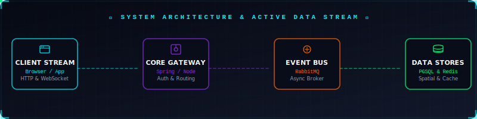

  

  

  

---

## TECHNICAL ARCHITECTURE & SYSTEMS ENGINEERING

A checklist of core backend paradigms and architectural patterns I implement to build resilient, distributed, and high-performance systems:

### Concurrency & Distributed Locking
* [x] **Race Condition Prevention:** Implemented database-level pessimistic locking (`SELECT FOR UPDATE`) to guarantee transactional isolation during state changes.
* [x] **Distributed Locks:** Utilized **Redis (Redlock/Redisson)** to orchestrate distributed locking across horizontally-scaled API instances.

### High-Availability WebSockets & Sync
* [x] **Horizontal Scaling:** Scaled WebSocket nodes using **Redis Pub/Sub Adapter** to synchronize connections and broadcast events across multiple instances.
* [x] **Resilient Reconnection:** Built connection state recovery to automatically buffer and replay missed events upon reconnection.

### Event-Driven Architecture & Messaging
* [x] **At-Least-Once Delivery:** Engineered event streams using **RabbitMQ / Kafka** with manual acknowledgements and publisher confirms.
* [x] **Fault Tolerance:** Implemented **Dead Letter Queues (DLQ)** with exponential backoff retries, and **Idempotency checks** (via Redis tokens) to prevent duplicate processing.

### Multi-Processing & Thread Offloading
* [x] **CPU-Intensive Task Delegation:** Isolated heavy computations from the main event loop using **Node.js Worker Threads / Child Processes** and **Spring ThreadPoolTaskExecutor**.

### Caching Strategies & Rate Limiting
* [x] **Cache Patterns:** Applied Cache-Aside pattern using **Redis** with strategic TTLs to minimize database load.
* [x] **DDoS & API Protection:** Structured sliding-window rate limiters at the gateway and application level utilizing Redis.

### Asynchronous AI Orchestration
* [x] **Non-Blocking LLM Integration:** Offloaded heavy AI generation/inference requests to background workers using message queues.
* [x] **Real-time Streaming:** Implemented **Server-Sent Events (SSE)** to stream LLM responses to clients with minimal latency.

### Integration Testing & Reliability
* [x] **Isolated E2E Testing:** Configured **Testcontainers** (Docker-in-Test) to spin up ephemeral Postgres, Redis, and RabbitMQ instances for deterministic integration testing.
* [x] **CI/CD Quality Gates:** Maintained high test coverage with automated unit & integration test suites.

### Low-Latency Geospatial Indexing
* [x] **Spatial Computing:** Indexed coordinates using **Uber H3 Spatial Hexagons** and **PostGIS** for sub-millisecond proximity queries.

---

## TECH STACK & TOOLCHAIN

Comfortable working across these languages, frameworks, databases, and infrastructure tools:

### Languages & Core Runtimes

  
  
  
  
  
  

### Frameworks & Core Libraries

  
  
  
  
  
  
  
  
  

### Databases, Caching & Cloud Infrastructure

  
  
  
  
  
  
  
  

### DevOps, Infrastructure & Tools

  
  
  
  
  

---

## CONNECTIVITY BOARD

Let's discuss system design, backend architectures, or high-performance APIs!

  
  
  
  

---

  System Status: Active | Built with ❤️ and high-performance backend pipelines

