<p align="center">
  
</p>

```bash
LOC@KIDCUTE1412:~$ systemctl status engineer-profile.service
● engineer-profile.service - Le Tuan Loc (Backend Systems Engineer)
   Loaded: active (running) since Sep 2023 (University of Science - VNUHCM)
   Status: "Architecting high-concurrency, real-time & spatial distributed systems"
   Main Tech: Java (Spring Boot) | Node.js (TypeScript) | PostgreSQL (PostGIS) | Redis
   Performance: [■■■■■■■■■■■■■■■■■■■■] 100% | High-Performance Mode Initialized.
```

---

## ⚡ CORE SYSTEMS CAPABILITIES

What makes me stand out as a backend developer:

*   **🔒 High Concurrency & State Integrity**: Expert in managing complex race conditions during high-volume operations (e.g. concurrent auction bidding) using **Pessimistic Database Locking (`SELECT FOR UPDATE`)** and transactional boundaries.
*   **🗺️ Spatial Indexing & Geospatial Queries**: Designing low-latency mapping and routing systems using **Uber H3 Spatial Hexagonal Indexing**, **PostGIS** geo-queries, and **GraphHopper** path calculations.
*   **⚡ Resilient Real-Time Orchestration**: Building robust bidirectional sync layers using **Socket.io** (with **Connection State Recovery** for network recovery) and **Supabase Realtime**.
*   **📩 Distributed Messaging & Reliability**: Strong understanding of building fault-tolerant architectures using **RabbitMQ** for asynchronous tasks, and applying **Idempotency** patterns to ensure duplicate-free API processing during network retries.
*   **🏗️ Modular Clean Architecture**: Designing loose-coupled backend monoliths using asynchronous messaging paradigms like **Spring ApplicationEvents** to keep core domains independent.

---

## 🛠️ TECH STACK & TOOLCHAIN

I am comfortable working across these languages, frameworks, and infrastructure utilities:

### 💻 Languages & Core Runtimes
<p align="left">
  <a href="#"></a>
  <a href="#"></a>
  <a href="#"></a>
  <a href="#"></a>
  <a href="#"></a>
  <a href="#"></a>
</p>

### 🚀 Frameworks & Core Libraries
<p align="left">
  <a href="#"></a>
  <a href="#"></a>
  <a href="#"></a>
  <a href="#"></a>
  <a href="#"></a>
  <a href="#"></a>
  <a href="#"></a>
  <a href="#"></a>
  <a href="#"></a>
</p>

### 💾 Databases, Caching & Cloud Infrastructure
<p align="left">
  <a href="#"></a>
  <a href="#"></a>
  <a href="#"></a>
  <a href="#"></a>
  <a href="#"></a>
  <a href="#"></a>
  <a href="#"></a>
</p>

### 🛠️ DevOps, Infrastructure & Tools
<p align="left">
  <a href="#"></a>
  <a href="#"></a>
  <a href="#"></a>
  <a href="#"></a>
  <a href="#"></a>
</p>

---

## 🤝 CONNECTIVITY BOARD

Let's discuss system design, backend architectures, or high-performance APIs!

<p align="left">
  <a href="mailto:letuanloc1412@gmail.com">
    
  </a>
  <a href="https://github.com/KidCute1412">
    
  </a>
  <a href="https://www.linkedin.com/in/l%E1%BB%99c-l%C3%AA-tu%E1%BA%A5n-341208390/">
    
  </a>
  <a href="https://www.facebook.com/le.tuan.loc.39104/?locale=vi_VN">
    
  </a>
  
</p>

---
<p align="center" style="font-size: 11px; color: #4b5563;">
  System Status: Active | Built with ❤️ and high-performance backend pipelines
</p>
