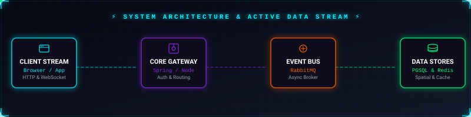
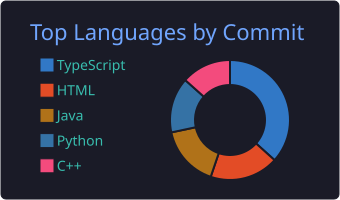
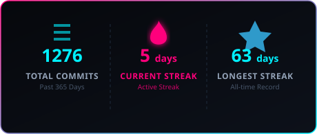
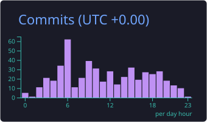
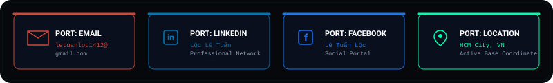

  

  

  

## ABOUT ME

Computer Science student at **VNUHCM University of Science** with a focus on backend and full-stack engineering.

I build transaction-safe APIs, event-driven workflows, real-time systems, and data-intensive applications with TypeScript, Node.js, PostgreSQL, Redis, and Kafka. I am particularly interested in concurrency control, system reliability, asynchronous processing, and practical system design.

---

## FEATURED PROJECTS

### Backend & Distributed Systems

| Project | Technologies | Highlights |
| :--- | :--- | :--- |
| [**Miracle Auction Platform**](https://github.com/KidCute1412/miracle-auction-platform) | `TypeScript` `PostgreSQL` `Redis` `Kafka` `Socket.IO` | Real-time auction platform with concurrency-safe bidding, ordered event projection, transactional outbox delivery, reconnect recovery, and operational diagnostics. |
| [**Mutux**](https://github.com/KidCute1412/startup-k23-hcmus) | `TypeScript` `NestJS` `PostgreSQL` `Next.js` | Five-person gaming-gear rental project. Served as Backend Head and contributed to authentication, KYC, credit workflows, transactional finance, catalog search, testing, and deployment. |
| [**UniHub**](https://github.com/Luke23127006/UniHub) | `JavaScript` `System Design` | University platform designed around high-concurrency registration, dispute handling, traffic spikes, asynchronous AI processing, and offline QR check-in. |

### AI & Applied Systems

| Project | Technologies | Highlights |
| :--- | :--- | :--- |
| [**HypeRoom**](https://github.com/KidCute1412/VietnameseHackAIthon2026-SocialMedia) | `Python` `FastAPI` `Redis/RQ` `React` `WebSocket` | AI-assisted newsroom workflow for evidence retrieval, claim analysis, risk reporting, and editorial support. Qualified for Round 2 of the Vietnamese Student HackAIthon 2026. |
| [**AidBridge**](https://github.com/phatnguyen975/AidBridge/tree/feature/backend) | `Java` `Spring Boot` `PostGIS` `Uber H3` | Disaster-relief coordination system using geospatial indexing, route-aware volunteer dispatch, real-time tracking, and retryable mission workflows. |

### Software Engineering & Game Development

| Project | Technologies | Highlights |
| :--- | :--- | :--- |
| [**Mario-Reflourished**](https://github.com/Luke23127006/Mario-Reflourished) | `C++` `SFML` `OOP` | Game project focused on refactoring gameplay code, improving object-oriented structure, and organizing rendering and game-state logic. |

---

## SYSTEM ARCHITECTURE DIAGRAM AND TELEMETRY

  

---

## CORE STRENGTHS

Key capabilities demonstrated across my projects:

- **Backend & Data:** Transaction-safe APIs, PostgreSQL, Redis, search, and concurrency control.
- **Event-Driven Systems:** Redis Streams, Kafka, transactional outbox, workers, retries, and idempotency.
- **Real-Time Applications:** WebSocket/Socket.IO synchronization and reconnect recovery.
- **Security & Quality:** Authentication, CSRF, RBAC, rate limiting, integration testing, Docker, and CI/CD.
- **Applied Systems:** PostGIS, Uber H3, route-aware dispatch, and real-time tracking.

### ✦ In-Memory Atomic Authority & Concurrency Control
* **Atomic Lua Mutations:** Used **Redis Lua Scripts (`EVALSHA`)** to atomically validate bidding windows, anti-sniping extensions, proxy bid increments, and balance checks.
* **Synchronous Replica Acknowledgment:** Used `WAIT 1` replica acknowledgments in the benchmarked bid path to improve write durability before responding.
* **Pessimistic & Distributed Locking:** Applied database-level `SELECT FOR UPDATE` and **Redis distributed locks (Redlock/Redisson)** for cross-instance coordination and transactional state isolation.

### ✦ Event Streaming & Ordered Durable Projection
* **Append-Only Stream Ingestion:** Logged mutation events into **Redis Streams** as an ordered durable commit log, decoupling high-throughput ingest from disk I/O.
* **Idempotent Single Projector:** Designed background workers (`auction-worker`) consuming streams with sequence fencing and per-entity sequence counters to project authoritative state into **PostgreSQL** without duplication or reordering.

### ✦ Dual-Write Elimination & Messaging (Transactional Outbox)
* **Transactional Outbox Pattern:** Eliminated dual-write hazards by storing outbound domain events directly inside PostgreSQL transactional boundaries.
* **Asynchronous Outbox Relay:** Built dedicated polling/leasing relays to stream committed events to **Apache Kafka** with aggregate partition keys for guaranteed partition ordering.
* **Fault Tolerance & DLQ:** Configured **Dead Letter Queues (DLQ)** with exponential backoff retries and consumer idempotency fences.

### ✦ Post-Commit Real-Time Synchronization
* **Post-Commit WebSocket Broadcast:** Broadcasted live state updates via **Socket.IO (Redis Pub/Sub Adapter)** after PostgreSQL projection commits.
* **Connection State Recovery:** Implemented heartbeat telemetry, room partitioning, and event buffering for seamless reconnection and state reconciliation.

### ✦ Modular Monolith & Process Isolation
* **Multi-Process Architecture:** Structured backends with decoupled composition roots (`API Process`, `Projector Worker`, `Outbox Relay`, `Async Worker`) sharing core domain contracts while isolating HTTP ingress latency from background tasks.
* **Thread & CPU Offloading:** Isolated heavy computations and background workers from the main event loop using **Node.js Worker Threads** and **Spring ThreadPoolTaskExecutor**.

### ✦ API Defense, Security & Caching
* **Defense-in-Depth Protection:** Structured sliding-window rate limiters via Redis, strict CORS, CSRF token validation, Helmet headers, and RBAC permissions.
* **End-to-End Traceability:** Injected `X-Request-ID` correlation tokens across the HTTP gateway, database transactions, Kafka events, and structured logs.
* **Cache-Aside & Strategic Invalidation:** Optimized reads using Redis cache layers with strategic TTLs to minimize database load.

### ✦ Deterministic Testing & Performance Benchmarking
* **Containerized Integration Testing:** Configured **Testcontainers** (Docker-in-Test) to orchestrate ephemeral PostgreSQL, Redis primary/replica, and Kafka clusters for deterministic CI/CD pipelines.
* **Concurrency & Load Profiling:** Measured throughput and latency under concurrent traffic using **k6 load test suites**.

### ✦ Low-Latency Geospatial Indexing
* **Spatial Computing:** Used **Uber H3 Spatial Hexagons** and **PostGIS** for geospatial indexing and proximity queries.

---

## TECH STACK

Primary technologies used across my projects:

### Languages & Core Runtimes

  
  
  
  
  
  
  

### Frameworks & Core Libraries

  
  
  
  
  
  
  
  
  
  
  

### Databases, Caching & Cloud Infrastructure

  
  
  
  
  
  
  
  
  

### DevOps, Infrastructure & Tools

  
  
  
  
  

---

## GITHUB TELEMETRY & SYSTEM ANALYTICS

  
  

  
  

---

## CONNECTIVITY BOARD

Let's discuss system design, backend architectures, or high-performance APIs!

  

  
  
  

---

## 🐍 CONTRIBUTION MATRIX ANIMATION

  <picture>
    <source media="(prefers-color-scheme: dark)" srcset="https://raw.githubusercontent.com/KidCute1412/KidCute1412/output/github-contribution-grid-snake-dark.svg">
    <source media="(prefers-color-scheme: light)" srcset="https://raw.githubusercontent.com/KidCute1412/KidCute1412/output/github-contribution-grid-snake-light.svg">
    
  </picture>

---

## ⚡ DEV QUOTE & MOTTO

  

---

<!-- System Operational Status Banner -->

  
  

  ⚡ System Status: Active | Built with passion and high-performance backend pipelines

